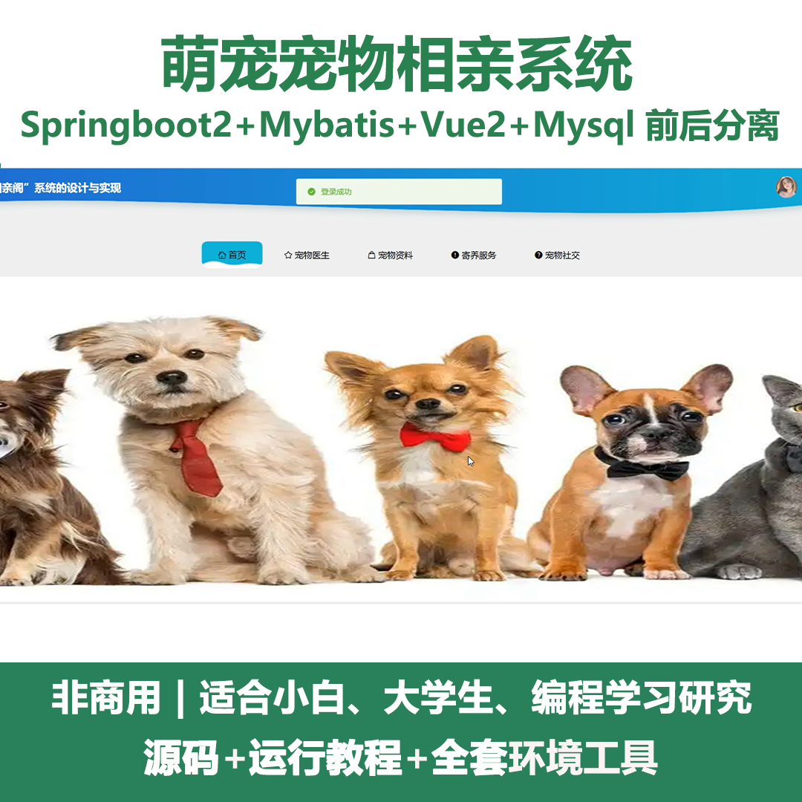
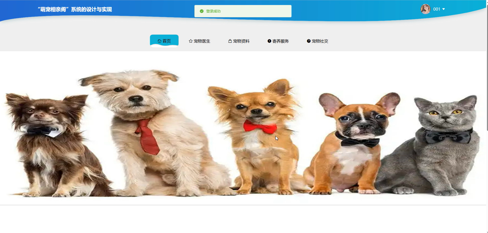
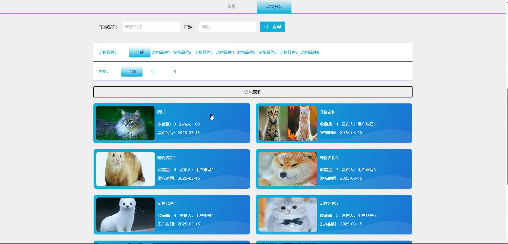
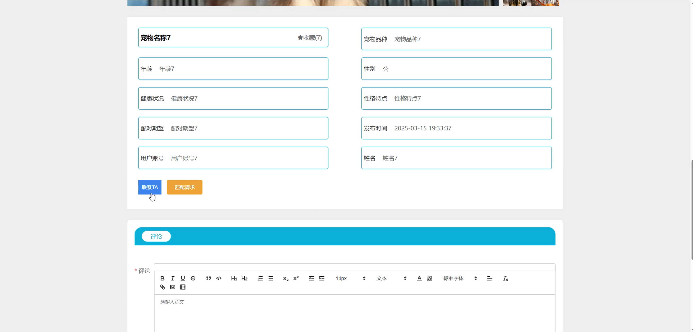
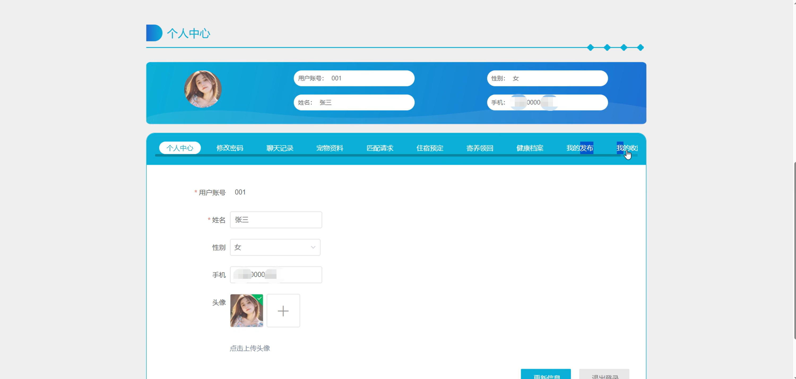
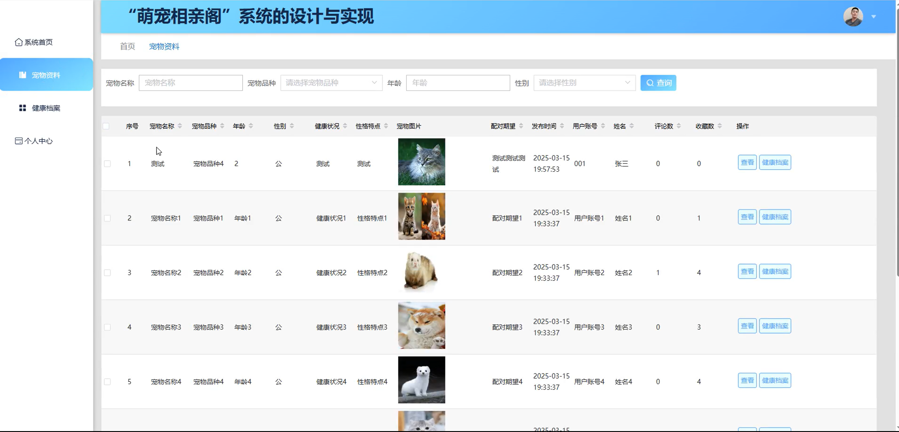
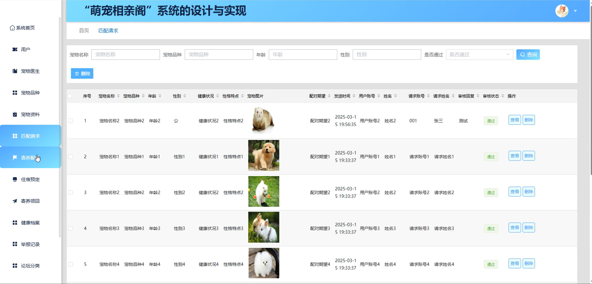
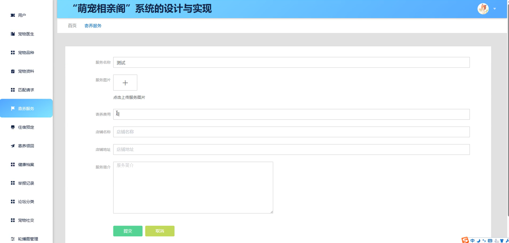
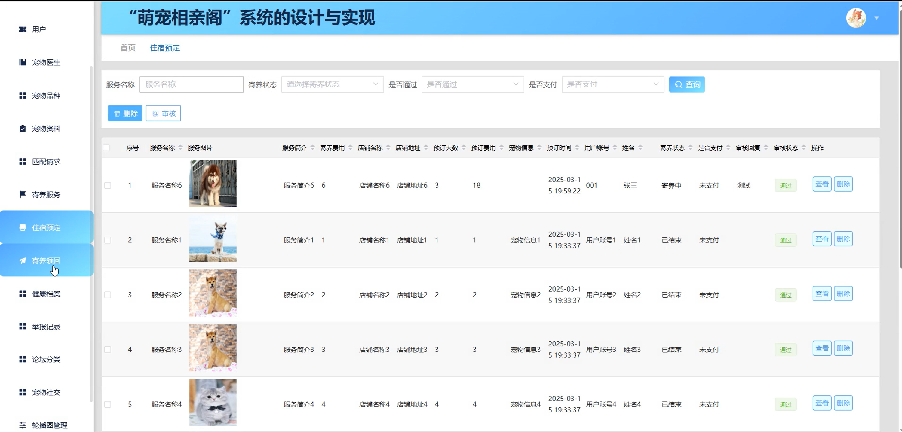

# springbootA450D
springbootA450D萌宠宠物相亲系统
 
## 查看主页获取源码

### 一、关键词
宠物医生、宠物品种、宠物资料

### 二、作品包含
源码+数据库+全套环境和工具资源+本地部署教程

### 三、项目技术
前端技术：Html、Css、Js、Vue2.0、Element-ui 
后端技术：Java、SpringBoot2.0、MyBatis

### 四、运行环境（以下版本亲测，其他版本未知，请自测）
开发工具：IDEA/eclipse  + VSCODE

数据库：MySQL5.7（最低要5.7版本）

数据库管理工具：Navicat10以上版本

环境配置软件： JDK1.8 + Maven3.6.3

前端Nodejs：14

浏览器：谷歌浏览器

### 五、项目介绍
项目编号：springbootA450D

萌宠宠物相亲系统主要用于为宠物主人提供便捷的宠物社交，助力宠物寻找合适伴侣以满足繁育需求或丰富社交生活。

角色：管理员、用户、宠物医生

用户功能：首页、宠物医生、宠物资料、寄养服务、宠物社交、个人中心、修改密码、聊天记录、宠物资料、匹配请求、住宿预定、寄养领回、健康档案、我的发布、我的收藏。

管理员功能：系统首页、用户、宠物医生、宠物品种、宠物资料、匹配请求、寄养服务、住宿预定、寄养领回、健康档案、举报记录、论坛分类。

宠物医生功能：系统首页、宠物资料、健康档案、个人中心。

### 六、运行截图

